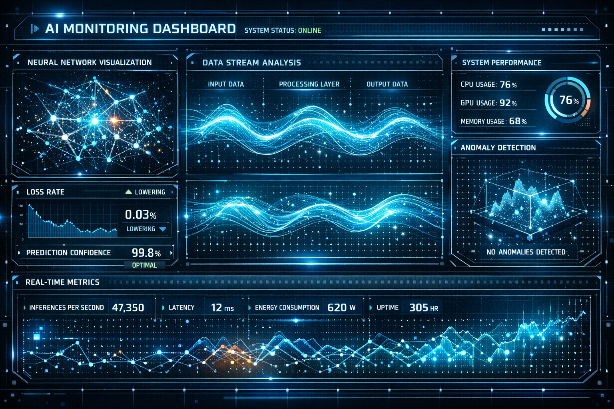

# START HERE - Business Visuals Quick Start

**You have 24 amazing business visuals ready to use!**

---

## 🚀 3-Step Quick Start

### Step 1: Preview the Images (30 seconds)
```bash
cd /d/workspace/ISNBIZ_Files
open preview_business_visuals.html
```
Or just **double-click** `preview_business_visuals.html`

This opens a beautiful gallery showing all 24 images organized by category.

---

### Step 2: Pick Your Favorites (2 minutes)
Use the **IMAGE_SELECTION_MATRIX.md** to quickly find the right images:

**Top Recommendations:**
- **Homepage Hero:** `office_innovation_lab.png`
- **About Section:** `office_boardroom_premium.png`
- **AI/Tech:** `dashboard_ai_monitoring.png`
- **Growth/Investor:** `growth_chart_upward.png`
- **Team/Culture:** `team_innovation_workshop.png`

---

### Step 3: Use in Website (5 minutes)

**Simple HTML example:**
```html
<!-- Hero Section -->
<section class="hero" style="background-image: url('assets/business/office_innovation_lab.png'); background-size: cover; background-position: center; height: 600px;">
    <div style="background: rgba(0,0,0,0.4); height: 100%; display: flex; align-items: center; justify-content: center;">
        <h1 style="color: white; font-size: 3rem;">Innovative Cloud & AI Solutions</h1>
    </div>
</section>

<!-- Solutions Grid -->
<div class="solutions">
    <div class="card">
        
        <h3>AI-Powered Applications</h3>
    </div>
    <div class="card">
        
        <h3>Cloud Infrastructure</h3>
    </div>
</div>
```

**That's it!** Your website now has professional, brand-aligned visuals.

---

## 📚 Documentation (Read When Needed)

All guides are ready if you need more details:

1. **BUSINESS_VISUALS_COMPLETE.md** - Full generation report
2. **BUSINESS_VISUALS_USAGE_GUIDE.md** - Detailed integration guide
3. **IMAGE_SELECTION_MATRIX.md** - Quick selection reference
4. **BUSINESS_VISUALS_DELIVERABLES.md** - Complete deliverables

---

## 🎯 Common Questions

### "Which image for my homepage hero?"
**Answer:** `office_innovation_lab.png` - Most engaging and professional

### "How do I make images smaller for web?"
```bash
# Convert to WebP (30-50% smaller)
cd assets/business
for img in *.png; do
    cwebp -q 85 "$img" -o "${img%.*}.webp"
done
```

### "Where are all the images?"
**Answer:** `D:\workspace\ISNBIZ_Files\assets\business\`

### "Can I use these commercially?"
**Answer:** Yes! Generated specifically for ISN.BIZ investor website

### "What if I need more images?"
```bash
# Edit prompts and regenerate
cd /d/workspace/ISNBIZ_Files
python3 generate_business_visuals_parallel.py
```

---

## ✅ Quick Checklist

- [ ] Preview images in `preview_business_visuals.html`
- [ ] Select best images for each section
- [ ] Add images to website HTML
- [ ] Test on different devices
- [ ] Optional: Convert to WebP for smaller size
- [ ] Optional: Upload to S3/CDN for faster delivery

---

## 🔥 Pro Tips

1. **Dark overlay for text readability:**
   ```css
   .hero::before {
       content: '';
       position: absolute;
       inset: 0;
       background: rgba(0, 0, 0, 0.4);
   }
   ```

2. **Lazy loading for performance:**
   ```html
   
   ```

3. **Responsive images:**
   ```html
   <picture>
       <source srcset="assets/business/office_innovation_lab.webp" type="image/webp">
       
   </picture>
   ```

---

## 🎨 All 24 Images At a Glance

### Office Scenes (Modern Workspaces)
- office_collaboration_modern.png
- office_innovation_lab.png ⭐
- office_boardroom_premium.png ⭐
- office_open_workspace.png

### Dashboards (Analytics & Monitoring)
- dashboard_analytics_premium.png ⭐
- dashboard_ai_monitoring.png ⭐
- dashboard_cloud_control.png
- dashboard_enterprise_metrics.png

### Growth (Success & Expansion)
- growth_chart_upward.png ⭐
- growth_global_expansion.png
- growth_success_trajectory.png

### Team (Collaboration)
- team_strategy_session.png
- team_innovation_workshop.png ⭐
- team_digital_collaboration.png

### Infrastructure (Technical)
- infrastructure_server_room.png
- infrastructure_cloud_network.png ⭐
- infrastructure_datacenter.png

### Interfaces (Software UI)
- interface_ai_platform.png
- interface_enterprise_app.png
- interface_cloud_console.png

### Innovation (Future Tech)
- innovation_ai_neural.png ⭐
- innovation_quantum_computing.png
- innovation_automation_flow.png
- innovation_digital_transformation.png

⭐ = Most versatile/recommended

---

## 🚀 You're Ready!

Everything you need is here:
- ✅ 24 professional images
- ✅ Complete documentation
- ✅ Interactive preview
- ✅ Usage examples
- ✅ Reusable scripts

**Next:** Open `preview_business_visuals.html` and start picking your favorites!

---

**Questions?** Check the comprehensive guides in this directory.

**Need Help?** All documentation is self-contained and searchable.

**Good Luck!** 🎉
