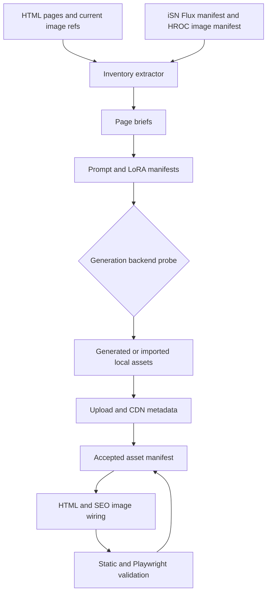

# feat: Build product visual workflow

## Summary

Build a durable content-and-visual workflow for the iSN.BiZ and HROC static sites. The work creates inventories, page briefs, prompt packs, LoRA recipes, asset manifests, upload metadata, page wiring, and validation gates before replacing any visible product imagery.

---

## Problem Frame

The iSN product pages have substantial product copy, but most current product visuals reuse Spirit Atlas background assets while alt text describes product-specific scenes. HROC has the opposite problem: it already has a large generated image library, but the current site needs a mapping and quality pass before requesting new images. The implementation needs one workflow that covers both sites without flattening their brands or deploy paths.

The upstream requirements establish the scope: iSN gets current product-specific art for the canonical six products, while HROC starts with manifest mapping and selective replacement only (see origin: `docs/brainstorms/2026-06-10-product-page-visual-workflow-requirements.md`).

---

## Requirements

- R1. The workflow must produce a machine-readable inventory for iSN pages and HROC pages before prompt generation or page rewrites.
- R2. The workflow must preserve the canonical six-product iSN portfolio and keep HROC framed as a cause partner, not a seventh product.
- R3. Each canonical iSN product must have page-specific prompt metadata for hero, OG, card, and supporting study slots.
- R4. LoRA names, trigger phrases, and recommended strengths must be stored as data rather than copied only into prose.
- R5. HROC image work must begin by mapping the existing 56-image manifest to the current HROC pages before generating replacements.
- R6. Generated or remapped assets must carry source prompt, backend, model, LoRA stack, slot, filename, alt text, CDN URL, and acceptance status.
- R7. Page wiring must update hero, key-art, card, OG, and Twitter image references only after an asset passes manifest validation.
- R8. The workflow must respect approved image hosts and prefer the `b2c.isn.biz` CDN pattern for iSN assets.
- R9. Product pages must retain SEO metadata, body-copy floors, nav/footer invariants, and mobile no-horizontal-scroll constraints.
- R10. The workflow artifacts must be trackable by Git without exposing local generated image binaries or secrets.

---

## Key Technical Decisions

- KTD1. Use a manifest-first workflow: the site should not be edited directly from generated files. Inventory, prompt, generation, upload, and acceptance metadata become the source of truth for page wiring.
- KTD2. Add new TypeScript workflow tooling under `tools/visual-workflow/`: new code should follow the repo guidance favoring Bun and TypeScript, while existing Python image-generation scripts remain reference implementations and optional backend adapters.
- KTD3. Keep iSN and HROC in one workflow but separate manifests: the brands, hosting, and deployment paths differ enough that a shared schema with site-specific records is safer than one combined asset list.
- KTD4. Normalize asset slots before backend selection: `hero`, `og`, `card`, and `study-*` names should be stable regardless of whether implementation uses TrueNAS ComfyUI, RunPod, fal.ai, or a manual import.
- KTD5. Repair tracking boundaries before adding durable docs: `docs/` is currently ignored, so the implementation should add narrow unignore rules for workflow artifacts rather than force-adding files ad hoc.
- KTD6. Extend the existing Playwright audit rather than create a parallel QA stack: page loading, approved hosts, SEO, word counts, and mobile overflow already live in `tests/site-audit.spec.js`.
- KTD7. Make page wiring a validated write step: the wiring tool should support a dry-run/report mode and should only write HTML after every referenced asset is accepted in the manifest.

---

## Acceptance Examples

- AE1. Given the current iSN site, when the inventory runs, then it reports exactly six product pages and flags non-Spirit Atlas product images that still point at Spirit Atlas background assets.
- AE2. Given the iSN prompt manifest, when validation runs, then every canonical product has `hero`, `og`, and `card` prompt records with LoRA metadata and alt text.
- AE3. Given a generated asset without a public CDN URL, when page wiring runs, then the workflow refuses to edit HTML and reports the missing upload metadata.
- AE4. Given the HROC generated-image manifest, when HROC mapping runs, then each manifest image is classified before any new HROC prompt is queued.
- AE5. Given wired product pages, when the browser audit runs, then approved-host, SEO, word-count, image-load, and mobile-overflow checks remain green.

---

## High-Level Technical Design



The core implementation is a data pipeline. Each stage writes explicit JSON and markdown artifacts, and the later stages refuse to proceed when required upstream fields are missing. This keeps creative decisions reviewable and prevents a generated image from being wired into a page without traceable prompt and CDN metadata.

---

## Output Structure

```text
tools/visual-workflow/
  inventory.ts
  prompts.ts
  validate.ts
  wire-pages.ts
  shared/
    schema.ts
    products.ts
docs/visual-workflow/
  inventory/
    isn-pages.json
    hroc-pages.json
  prompts/
    isn-product-prompts.json
    hroc-remap-prompts.json
  manifests/
    assets.json
    hroc-image-map.json
  reports/
    visual-gap-report.md
tests/
  visual-workflow.spec.ts
```

The exact file split can change during implementation, but the plan expects separate surfaces for schema, inventory, prompt data, validation, page wiring, and tests.

---

## Implementation Units

### U1. Track workflow artifacts and schema

**Goal:** Make durable workflow documents and metadata trackable while leaving large generated binaries ignored.

**Requirements:** R1, R6, R10

**Dependencies:** None

**Files:**

- `.gitignore`
- `tools/visual-workflow/shared/schema.ts`
- `tools/visual-workflow/shared/products.ts`
- `docs/visual-workflow/README.md`
- `tests/visual-workflow.spec.ts`

**Approach:** Add narrow unignore rules for the specific documentation and manifest directories needed by the workflow, such as `docs/brainstorms/`, `docs/plans/`, and `docs/visual-workflow/`. Keep local generated image binaries under ignored asset directories unless implementation chooses a small checked-in fixture. Define TypeScript data shapes for sites, pages, image slots, prompts, LoRA entries, generation records, CDN records, and acceptance statuses.

**Patterns to follow:** Use `_audit/CANON.md` for canonical iSN page/product facts and image host rules. Use `docs/truenas_flux_project_assets_manifest.json` and `hrocincorg/archive/website_internals/generated_images/image_manifest.json` as schema references, not as direct schemas.

**Test scenarios:**

- Covers AE2. Given a complete iSN product asset record, validation accepts required fields for site, page, slot, prompt, LoRA stack, alt text, and CDN URL.
- Given a record missing slot or alt text, validation fails with a specific field-level error.
- Given an image path under ignored local binary directories, Git tracking rules keep it ignored while allowing JSON and markdown workflow artifacts.

**Verification:** Workflow metadata files are visible to Git, generated binary folders remain ignored, and the schema tests prove required fields cannot be omitted silently.

### U2. Build page and asset inventory extraction

**Goal:** Generate current-state inventories for iSN and HROC pages from the actual HTML and existing manifests.

**Requirements:** R1, R2, R5, R8, R9

**Dependencies:** U1

**Files:**

- `tools/visual-workflow/inventory.ts`
- `tools/visual-workflow/shared/products.ts`
- `docs/visual-workflow/inventory/isn-pages.json`
- `docs/visual-workflow/inventory/hroc-pages.json`
- `docs/visual-workflow/reports/visual-gap-report.md`
- `tests/visual-workflow.spec.ts`

**Approach:** Parse the active iSN HTML pages and the current HROC HTML pages to collect title, meta description, H1/H2s, image URLs, alt text, OG/Twitter image URLs, page role, and visual-gap flags. Load the legacy iSN Flux manifest and HROC generated-image manifest as supplemental evidence. The extractor should flag reused Spirit Atlas backgrounds on non-Spirit Atlas product pages, portrait/9:16 images declared as 1200x630 OG assets, missing alt text, non-approved hosts, and HROC manifest images not currently used.

**Patterns to follow:** Mirror the `ALL_PAGES` and `PRODUCT_PAGES` concepts in `tests/site-audit.spec.js`. Use the canonical product list from `_audit/CANON.md` rather than deriving products from filenames.

**Test scenarios:**

- Covers AE1. Given the current six iSN product pages, the inventory classifies exactly six product pages and does not classify `hroc-files.html` as a product.
- Given a product page using `spiritatlas/images/backgrounds_24` outside Spirit Atlas, the visual-gap report flags it as a reused-product-image mismatch.
- Given a page with OG/Twitter image metadata, the inventory captures both values and compares them against the page hero image.
- Given HROC manifest entries, the HROC inventory reports used, unused, and repeated image references.

**Verification:** Running the inventory produces JSON files for both sites and a markdown visual-gap report that names current image mismatches without editing HTML.

### U3. Normalize iSN prompt packs and LoRA recipes

**Goal:** Convert the brainstorm prompt matrix into structured prompt data for all six iSN products.

**Requirements:** R3, R4, R6

**Dependencies:** U1, U2

**Files:**

- `tools/visual-workflow/prompts.ts`
- `docs/visual-workflow/prompts/isn-product-prompts.json`
- `docs/visual-workflow/manifests/assets.json`
- `tests/visual-workflow.spec.ts`

**Approach:** Store prompt records for Spirit Atlas, Provenance, Signals, Phantom Browser, Crucible, and HERMES + AiNGELS. Each product should have planned slots for `hero`, `og`, `card`, and any needed `study-*` images. Carry LoRA names, trigger text, recommended model/clip ranges, negative constraints, target aspect ratio, page slot, alt text draft, and filename. Mark legacy prompts from `docs/truenas_flux_project_assets_manifest.json` as reference material where useful, but do not let retired product slugs become current products.

**Patterns to follow:** Use the current prompt language and LoRA stack recommendations from the origin requirements. Use `scripts/isnbiz_prompts.jsonl` as an example of one-record-per-asset prompt data, while improving the schema to include current product slugs and acceptance metadata.

**Test scenarios:**

- Covers AE2. Given the prompt manifest, each canonical product has at least `hero`, `og`, and `card` slots.
- Given Signals and HERMES + AiNGELS, prompt records exist even though no legacy iSN Flux records matched those current product names.
- Given retired slugs such as `gedfix` or `llm-security-research`, normalization maps them only as references for Provenance and Crucible rather than active product pages.
- Given a prompt record without a LoRA stack, validation fails before generation.

**Verification:** The prompt manifest is complete for the six current products and can be validated without contacting any image backend.

### U4. Add backend probe and generation/import adapters

**Goal:** Let implementation generate or import assets without hardcoding one currently available backend.

**Requirements:** R3, R4, R6, R10

**Dependencies:** U3

**Files:**

- `tools/visual-workflow/generate.ts`
- `tools/visual-workflow/shared/schema.ts`
- `tests/visual-workflow.spec.ts`

**Approach:** Add a TypeScript orchestration layer that can validate prompt records, probe backend configuration, and dispatch to a selected adapter. Treat the existing ignored Python scripts as backend-specific references, not primary tracked implementation files. If implementation needs to preserve behavior from those scripts, port the behavior into tracked TypeScript adapters or explicitly promote a script with a narrow Git ignore exception. Support a manual import mode for cases where images are generated outside the repo and need to be registered with prompt metadata.

**Execution note:** Characterize the current Python script behavior before changing it, especially manifest shape and output path behavior.

**Patterns to follow:** Keep secret-bearing values in environment variables or existing credential systems. Do not add API keys, endpoint tokens, or local host assumptions to committed manifests.

**Test scenarios:**

- Given no backend credentials, the probe reports unavailable backends without modifying prompt or asset manifests.
- Given a manual import record with local file metadata, the adapter registers the asset as generated/imported but not uploaded or accepted.
- Given a backend response record, the orchestration layer stores backend, model, seed or prompt ID when available, output path, and generation status.
- Given missing LoRA availability from a backend probe, the workflow blocks generation for that asset and records the missing LoRA names.

**Verification:** Generation can be planned, probed, or manually registered without committing secrets or requiring the specific TrueNAS/RunPod/fal.ai path to be live during tests.

### U5. Repair upload and CDN metadata workflow

**Goal:** Convert accepted local assets into CDN metadata records that page wiring can trust.

**Requirements:** R6, R7, R8, R10

**Dependencies:** U4

**Files:**

- `tools/visual-workflow/upload.ts`
- `tools/visual-workflow/validate.ts`
- `docs/visual-workflow/manifests/assets.json`
- `tests/visual-workflow.spec.ts`

**Approach:** Replace the current ignored upload-script behavior with a tracked TypeScript upload/registration workflow that derives repo paths dynamically and uses the product-visual slot naming from the manifest. Store target object keys and public CDN URLs in the asset manifest after upload or after manual CDN registration. Keep conversion to WebP and B2 upload as an implementation option, but make the manifest the gate for whether a page can use an asset.

**Patterns to follow:** iSN CDN URLs should follow the `https://b2c.isn.biz/file/isnbiz-cdn/...` pattern from `_audit/CANON.md` and `CLAUDE.md`. HROC records should preserve whether an asset lives on the HROC S3 bucket or the iSN B2 CDN.

**Test scenarios:**

- Given an iSN asset with slug `signals` and slot `og`, the workflow derives a CDN key under `assets/generated/product-visuals/signals/og.webp`.
- Given a CDN URL on an unapproved host for an iSN page, validation fails before wiring.
- Given a generated local asset without an uploaded CDN URL, page wiring refuses to reference it.
- Given an HROC S3 URL already present in the manifest, validation preserves it as an HROC-specific asset record rather than rewriting it to iSN B2.

**Verification:** The asset manifest contains only validated public URLs for accepted assets, and existing upload hardcoding is removed or bypassed by repo-relative tooling.

### U6. Wire validated iSN assets into pages

**Goal:** Replace generic iSN product imagery with accepted product-specific image references.

**Requirements:** R2, R3, R6, R7, R8, R9

**Dependencies:** U2, U3, U5

**Files:**

- `tools/visual-workflow/wire-pages.ts`
- `index.html`
- `portfolio.html`
- `spiritatlas.html`
- `provenance.html`
- `signals/index.html`
- `phantom-browser.html`
- `crucible.html`
- `hermes-aingels.html`
- `tests/site-audit.spec.js`
- `tests/visual-workflow.spec.ts`

**Approach:** Update product-page hero/key-art grids, homepage product cards, portfolio cards, OG images, Twitter images, and alt text from accepted manifest records. Keep the existing page structure and nav/footer untouched. The wiring script should be idempotent and should fail if an expected asset slot is missing or unaccepted.

**Technical design:** Directional guard sequence for the wiring tool:

```text
load accepted asset manifest
load target page inventory
for each planned replacement:
  verify slot exists and is accepted
  verify CDN URL host is allowed for the target site
  verify replacement alt text is non-empty and page-specific
  stage the HTML/meta replacement
if any replacement fails:
  write a report only
else:
  write page updates
```

**Patterns to follow:** Preserve the product page layout conventions and the test-locked invariants in `_audit/CANON.md`. Use the current `project-spirit-theme.css` and `styles.css` visual system rather than introducing a new front-end theme.

**Test scenarios:**

- Given accepted assets for all six products, the wiring script updates homepage and portfolio product cards to product-specific card images.
- Given accepted `og` assets, product pages use 1200x630 social images for both OG and Twitter image tags.
- Covers AE3. Given a missing accepted asset for one slot, wiring fails without partially editing pages.
- Covers AE5. Given wired pages, `tests/site-audit.spec.js` still passes existing page-load, image-host, SEO, word-count, and mobile checks.

**Verification:** iSN pages no longer use generic Spirit Atlas background URLs for non-Spirit Atlas product visuals, and automated audit coverage remains green.

### U7. Map and selectively refresh HROC assets

**Goal:** Apply the shared workflow to HROC by mapping existing assets first and generating only documented gaps.

**Requirements:** R1, R5, R6, R10

**Dependencies:** U1, U2, U5

**Files:**

- `tools/visual-workflow/hroc-map.ts`
- `docs/visual-workflow/manifests/hroc-image-map.json`
- `docs/visual-workflow/prompts/hroc-remap-prompts.json`
- `hrocincorg/HROC_Website_New/index.html`
- `hrocincorg/HROC_Website_New/donate.html`
- `hrocincorg/HROC_Website_New/documents.html`
- `hrocincorg/HROC_Website_New/bri.html`
- `hrocincorg/HROC_Website_New/jonathan.html`
- `hrocincorg/HROC_Website_New/lilly.html`
- `tests/visual-workflow.spec.ts`

**Approach:** Build a mapping report from `hrocincorg/archive/website_internals/generated_images/image_manifest.json` to the current HROC pages. Identify which current HROC images are deliberate, duplicated, missing, or mismatched. Generate new HROC prompt records only for missing or rejected placements. Treat dignity, cultural sensitivity, and trauma-informed tone as acceptance criteria, not optional copy review.

**Patterns to follow:** Preserve HROC's current site style and its separate deployment path under `hrocincorg/HROC_Website_New/`. Use `hrocincorg/CLAUDE.md` for HROC mission and hosting context, but verify deployment facts during implementation before changing deploy config.

**Test scenarios:**

- Covers AE4. Given the 56-image HROC manifest, every image is classified as used, unused, candidate, rejected, or unknown.
- Given a HROC page that uses the same image multiple times, the report distinguishes deliberate repetition from missing variety.
- Given an image flagged as medically alarming or culturally weak, the workflow creates a replacement prompt record instead of wiring it automatically.
- Given HROC page changes, image references remain on the known HROC S3 bucket or approved B2 paths.

**Verification:** HROC has a page-to-image mapping report and replacement prompt plan before any new generated HROC image is requested.

### U8. Add validation gates and documentation

**Goal:** Make the workflow repeatable and protect the site from visual regressions.

**Requirements:** R6, R7, R8, R9, R10

**Dependencies:** U1, U2, U3, U5, U6, U7

**Files:**

- `tools/visual-workflow/validate.ts`
- `tests/site-audit.spec.js`
- `tests/visual-workflow.spec.ts`
- `docs/visual-workflow/README.md`
- `docs/visual-workflow/reports/visual-gap-report.md`

**Approach:** Add validation for manifest completeness, accepted CDN URLs, approved hosts, slot coverage, 1200x630 OG requirements, alt-text presence, and page wiring consistency. Extend Playwright coverage where browser behavior matters, especially image loading and mobile overflow. Document the workflow in a concise operator guide that explains inventory, prompt review, generation/import, upload registration, acceptance, wiring, and QA.

**Patterns to follow:** Build on `tests/site-audit.spec.js` instead of duplicating its image host and page invariant checks. Keep instructions repo-relative and avoid local machine paths.

**Test scenarios:**

- Given a complete accepted asset manifest, validation passes all slot, CDN, and alt-text gates.
- Given a page whose OG image dimensions are declared 1200x630 but whose slot is not `og`, validation fails.
- Given wired HTML with an image URL outside approved iSN hosts, the Playwright audit reports the failure.
- Given workflow documentation examples, referenced paths are repo-relative and do not mention local absolute paths or secrets.

**Verification:** A developer can run the validation workflow, inspect the reports, and know whether page wiring is safe before opening a PR.

---

## Scope Boundaries

### In Scope

- Workflow metadata, manifests, and validation tooling.
- iSN product prompt and asset coverage for the six canonical products.
- Homepage, portfolio, and product-page image wiring after assets are accepted.
- HROC page-to-image mapping and replacement prompt planning.
- Narrow Git ignore changes for durable workflow artifacts.

### Deferred to Follow-Up Work

- Fully automated image generation across all backends.
- Automatic B2 or S3 credential retrieval and secret management changes.
- Contact form, analytics, schema expansion, or other unrelated website modernization tasks.
- Rebuilding HROC deployment infrastructure or removing Netlify.
- Rewriting the visual design systems for either site.

### Outside This Work

- Adding new products or reviving retired product pages.
- Treating HROC as an iSN product.
- Committing large generated image binaries to Git.
- Adding unverified business, financial, medical, or impact claims.

---

## System-Wide Impact

This plan touches static site content, generated asset metadata, upload conventions, and CI validation. The highest-risk integration point is page wiring: changing image URLs affects SEO previews, browser image loading, and Cloudflare Pages deploy output. HROC also has a separate nested repository and deployment workflow, so implementation must avoid silently mixing iSN Cloudflare Pages assumptions into HROC Netlify/S3 behavior.

---

## Risks & Dependencies

- **Backend availability:** TrueNAS ComfyUI, RunPod, fal.ai, and any future provider may not be available in a given session. Mitigation: backend probing and manual import are first-class states, and no HTML wiring depends on live generation.
- **Ignored docs:** `docs/` is currently ignored. Mitigation: U1 adds narrow unignore rules before downstream artifacts are expected to be committed.
- **Large assets:** `assets/` is ignored and should stay that way. Mitigation: generated binaries are uploaded or manually registered, while manifests carry the committed state.
- **HROC deployment ambiguity:** HROC docs mention Netlify as current and also contain stale Wix/alternate-host notes. Mitigation: U7 limits HROC work to mapping and page/image references unless implementation verifies deploy config.
- **Prompt/provider drift:** LoRA names and strengths are recommendations until a backend probe confirms availability and parameter names. Mitigation: U4 records missing LoRAs as blocked generation records rather than guessing substitutes.
- **Partial page rewrites:** A failed wiring pass could leave homepage, portfolio, and product pages inconsistent. Mitigation: U6 requires staging/dry-run behavior and all-or-nothing page writes from accepted manifest records.

---

## Phased Delivery

1. **Metadata foundation:** U1 through U3 create trackable schemas, inventories, visual-gap reports, and prompt manifests without touching live page HTML.
2. **Asset production path:** U4 and U5 establish generation/import, upload, CDN metadata, and acceptance state.
3. **Site wiring:** U6 wires accepted iSN assets into homepage, portfolio, product pages, and social metadata.
4. **HROC mapping:** U7 maps current HROC assets and produces replacement prompts only for documented gaps.
5. **Validation hardening:** U8 closes the loop with manifest validation, browser audit coverage, and operator documentation.

---

## Documentation / Operational Notes

Document the workflow as an operator path:

1. Produce inventory.
2. Review visual gaps.
3. Review prompt and LoRA manifests.
4. Probe or select generation/import backend.
5. Generate or import assets.
6. Register upload/CDN metadata.
7. Mark accepted assets.
8. Wire pages from accepted assets.
9. Run validation and browser audit.

The documentation should also state that prompt text is markdown/plain text only and that workflow examples must not include secrets or local absolute paths.

---

## Sources & Research

- `docs/brainstorms/2026-06-10-product-page-visual-workflow-requirements.md` defines the workflow scope, prompt matrix, and HROC mapping posture.
- `_audit/CANON.md` defines canonical iSN products, approved image hosts, nav/footer invariants, and SEO image conventions.
- `_audit/AUDIT_REPORT.md` records the latest 19-page modernization pass and the 111/111 Playwright baseline.
- `tests/site-audit.spec.js` provides the existing browser audit structure for page loading, image hosts, SEO basics, word counts, and mobile overflow.
- `scripts/truenas_flux_generate_project_assets.py`, `scripts/runpod_generate_project_assets.py`, `scripts/upload_project_assets.sh`, and `scripts/isnbiz_prompts.jsonl` show the current generation/upload patterns and the hardcoding that should be normalized.
- `hrocincorg/archive/website_internals/generated_images/image_manifest.json` is the source manifest for HROC image mapping.
- `hrocincorg/archive/website_internals/image-generator/MASTER_IMAGE_PLAN.md` and `hrocincorg/archive/website_internals/IMAGE_GENERATION_SUMMARY.md` document the HROC prompt and generated-image history.
- `CLAUDE.md` and `hrocincorg/CLAUDE.md` define site-specific stack, deploy, image hosting, and brand constraints.
